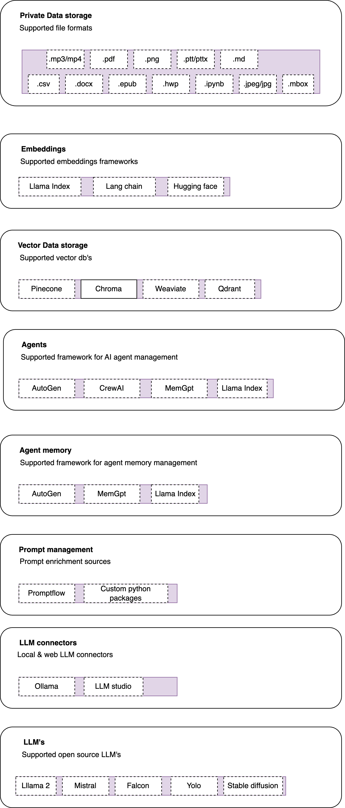

# Rafa: Your open-source Solution for private GPT and AI assistants 🚀

Welcome to Rafa, an open-source project that's all about making life easier for those who want to use a private GPT or to create AI assitants using complete open-source LLM's and framework's. Rafa is like your friendly neighborhood superhero framework, swooping in to save the day when you're struggling with the complexities of retrival augumented geeration (RAG) over private data. It's designed to be production-ready, so you can deploy Rafa-powered applications on your cloud or on-premise environments. No sweat! 💪

## The Problem: Private GPT DIY with open source LLM's 🧩

Ever watched one of those "Build your own private GPT in 10 minutes!" videos? Sounds like a breeze, doesn't it? Well, reality hits harder than a typo in your code. Sure, you might manage to cobble together a basic version, but when it's time to make it actually do something useful—whether for you, your team, or your company—that's when the AI fun really begins.

Suddenly, you're knee-deep in buzzwords: embeddings, vector databases, chaining—oh my! And don't even get me started on the joy of wrangling Python package dependencies. Just when you think you've got a handle on things, a tidal wave of new frameworks and packages crashes down everyday into the AI space, leaving you feeling like you're lost in a AI jungle.

To top it all off, half the tools you've gathered seem to do the same thing, like you're trying to pick the perfect emoji for a text message. Overall. it's IKEA furniture assembly, but without the instructions. 😬

## The Solution: Rafa to the Rescue! 🦸‍♂️

Rafa is a an end-to-end framework that handles all the tricky parts of implemention. So, even if you're not a tech wizard, you can use Rafa without breaking a sweat. It's like having your cake and eating it too! 🍰

It's designed to be a comprehensive tool for implementing private GPT and AI assistant management, so you don't have to worry about the nitty-gritty details and just foucs on the AI use-case/product you want to build over your private data using open-source LLM's 🧘‍♀️

## How Rafa Works 🛠️

The Rafa framework is structured into 8 layers, each meticulously crafted to accommodate the latest trends in AI frameworks. As the AI landscape continues to evolve, additional layers and frameworks can seamlessly integrate into the framework's architecture.

For those less acquainted with the technical intricacies, fret not. Simply deploy Rafa on your infrastructure, and let the Rafa AI agents automatically select the most optimal architecture tailored to your needs.

However, if you fancy yourself a bit tech-savvy, you have the freedom to customize your experience. By tweaking the config file, you can handpick the frameworks you wish to utilize in each layer, ensuring your desired architecture operates seamlessly behind the scenes. With Rafa, flexibility meets simplicity, empowering users to focus on their specific use-cases without unnecessary complexity.🇨🇭

Here's a high-level overview of how Rafa architecture:sacey 

## Getting Started 🏁

Ready to take Rafa for a spin? Check out the installation and usage instructions in the documentation. It's as easy as pie! 🥧

## Contributing 🤝

Rafa is an open-source project, and we love getting help from our community. It's like a potluck dinner - the more, the merrier! Check out the contributing guidelines for more information. 🎉

## License 📜

Rafa is licensed under MIT. For more details, please refer to the LICENSE file in the repository. It's like the rule book of our potluck dinner. 😉

So, what are you waiting for? Dive in and start exploring Rafa today! 🏊‍♀️🎈