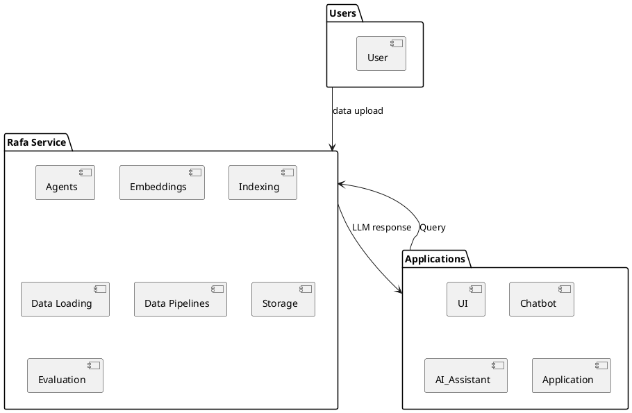

# Rafa: Your Go-To Solution for Retrieval Augmented Generation (RAG) 🚀

Welcome to Rafa, an open-source project that's all about making life easier for those who want to implement Retrieval Augmented Generation (RAG) in their applications. Rafa is like your friendly neighborhood superhero, swooping in to save the day when you're struggling with the complexities of RAG. It's designed to be production-ready, so you can deploy Rafa-powered applications on your cloud or on-premise environments. No sweat! 💪

## The Problem: LLMs and Your Data 🧩

Imagine Language Learning Models (LLMs) as a giant library filled with books. They've got a ton of information, but none of it is about your favorite topic. That's where RAG comes in. It's like a librarian who knows exactly where your favorite books are and brings them to you. But building a librarian like that isn't easy. It's like trying to assemble a 1000-piece puzzle without the picture on the box. You need a lot of data, AI expertise, and patience. 😅

## The Solution: Rafa to the Rescue! 🦸‍♂️

Rafa is here to take that puzzle and turn it into a fun game. It provides an end-to-end framework that handles all the tricky parts of implementing RAG. So, even if you're not a tech wizard, you can use Rafa without breaking a sweat. It's like having your cake and eating it too! 🍰

Sure, there are other open-source frameworks like LlamaIndex or LanChain, but they're like a DIY furniture kit with a missing instruction manual. And licensed applications like OpenAI? They're like a fancy restaurant that might give you a stomachache later (think data breaches and lack of control over AI responses). 🤷‍♂️

Rafa, on the other hand, is like your favorite comfort food - easy to use, secure, and reliable. It's designed to be a comprehensive tool for implementing RAG, so you don't have to worry about the nitty-gritty details. 🧘‍♀️

## How Rafa Works 🛠️

Rafa is like a backend service that can be deployed and can be integrated through REST APIs. It's built on top of LLamaIndex, LangChain, and other open-source libraries, so you can be sure that it's reliable and secure. Rafa is designed to be scalable, so you can use it for small projects or large-scale applications. It's like a Swiss Army knife for RAG! 🇨🇭

Here's a high-level overview of how Rafa works:

## Getting Started 🏁

Ready to take Rafa for a spin? Check out the installation and usage instructions in the documentation. It's as easy as pie! 🥧

## Contributing 🤝

Rafa is an open-source project, and we love getting help from our community. It's like a potluck dinner - the more, the merrier! Check out the contributing guidelines for more information. 🎉

## License 📜

Rafa is licensed under the [insert license here]. For more details, please refer to the LICENSE file in the repository. It's like the rule book of our potluck dinner. 😉

So, what are you waiting for? Dive in and start exploring Rafa today! 🏊‍♀️🎈