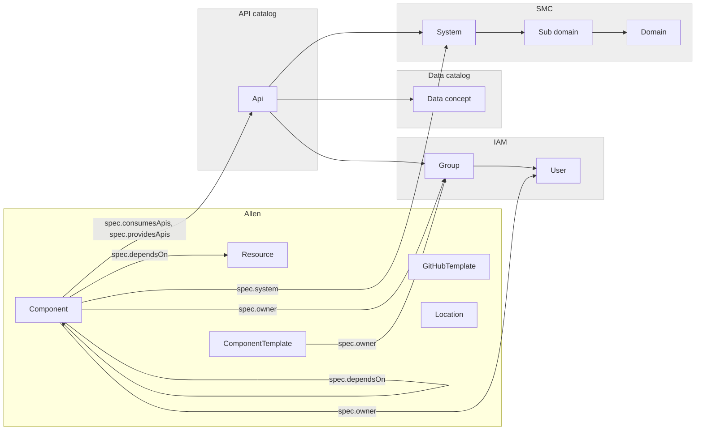

# The software catalog

## Introduction

The software catalog keeps track of ownership and metadata for all the software in Ingkas digital landscape.

The software catalog´s main objective is to

- help Engineers and teams to _manage_ the software they own
- make it easy to _explore_ existing software cross the software ecosystem

By implementing custom plugins, or enabling available open source plugins, see [Backstage Plugins](https://backstage.io/plugins), it is possible to gain insights and shorten feedback loops.

The remainder of this section covers specifics related to INGKAs Developer Portal. For upstream, in-depth documentation of the software catalog, system model, entities and descriptor format, recommended reading is found at [Backstage official documentation](https://backstage.io/docs/features/software-catalog/software-catalog-overview).

## Software catalog entities

### Overview



### User created entities

These entities are created/registered by Engineers to the software catalog, see [Add a Component to the catalog](add.md).

Entities include metadata, references to other entities, and annotations in order to map to external tooling or services, see [Integrate your components](integrations.md).

| Entity              | Description                                                                                                                                                                                                                                                                     | Reference field  |
| ------------------- | ------------------------------------------------------------------------------------------------------------------------------------------------------------------------------------------------------------------------------------------------------------------------------- | ---------------- |
| `Component`         | A component is a piece of software, for example a mobile feature, web site, backend service or documentation. A component can be tracked in source control, or use some existing open source, commercial software or SaaS                                                       | -                |
| `Location`          | A location is a marker that references other places to look for software catalog data. Could be useful e.g. for mono repos                                                                                                                                                      | -                |
| `Resource`          | Resources are the infrastructure a component needs to operate at runtime, like BigTable databases, Pub/Sub topics, S3 buckets or CDNs. Modelling them together with components and systems will better allow us to visualize resource footprint, and create tooling around them | `spec.dependsOn` |
| `ComponentTemplate` | Templates defines a software component (such as a backend service) that can be instantiated, including skeleton code, automation workflows, and integrations to needed tooling and infrastructure                                                                               | -                |

### Integrated entities

Instances of these identities have standard integrations in the Developer Portal.

| Entity           | Description                                                                                                                                                               | Reference field                        | Values                                                                                   | Integration                               |
| ---------------- | ------------------------------------------------------------------------------------------------------------------------------------------------------------------------- | -------------------------------------- | ---------------------------------------------------------------------------------------- | ----------------------------------------- |
| `GitHubTemplate` | An ingested repository template from GitHub.com                                                                                                                           |                                        | [GitHub.com templates](https://allen.ingka.com/catalog?filters%5Bkind%5D=GitHubTemplate) | GitHub.com                                |
| `System`         | Represents a native boundary of software capabilities from a software design and engineering perspective. A System can represent business software or technology software | `spec.system`                          | [Systems](https://allen.ingka.com/catalog?filters%5Bkind%5D=system)                      | System Master Catalog (System)            |
| `Domain`         | Software capabilities needed to support the Ingka retail business model within a specific functional domain.                                                              | -                                      | [Domains](https://allen.ingka.com/catalog?filters%5Bkind%5D=domain)                      | System Master Catalog (Architecture Area) |
| `API`            | An API describes an interface that can be exposed by a component. The API can be defined in different formats, like OpenAPI, AsyncAPI, GraphQL, gRPC                      | `spec.providesAPI`, `spec.consumesAPI` | [APIs](http://allen.ingka.com/api-docs)                                                  | API and Event catalog                     |
| `Group`          | The product team                                                                                                                                                          | `spec.owner`                           | [Groups](https://allen.ingka.com/catalog?filters%5Bkind%5D=group)                        | IAM (team)                                |
| `User`           | A user of the Developer Portal                                                                                                                                            | `spec.owner`                           | [Users](https://allen.ingka.com/catalog?filters%5Bkind%5D=user)                          | IAM (AD user)                             |

## Entity references

For entity references, use string references formatted like

`[<kind>:][<namespace>/]<name>`

thus is composed of between one and three parts in this specific order.

The name is always required. Depending on the context, you may be able to leave out the kind and/or namespace. If you do, it is contextual what values will be used, and the relevant documentation should specify which rule applies where. All strings are case insensitive.

All references are under the `spec` field in the descriptor.

Example below of a descriptor YAML file including references to other entities.

```yaml
apiVersion: backstage.io/v1alpha1
kind: Component
metadata:
  name: es-service-x
  annotations:
    github.com/project-slug: ingka-group-digital/es-service-x
    backstage.io/techdocs-ref: url:https://github.com/ingka-group-digital/es-service-x
  tags:
    - java
    - quarkus
spec:
  type: service
  owner: group:engineering-services
  lifecycle: alpha
  system: developer-portal
  providesApis:
    - api:default/example-api-x
  consumesApis:
    - api:default/example-api-y
```
