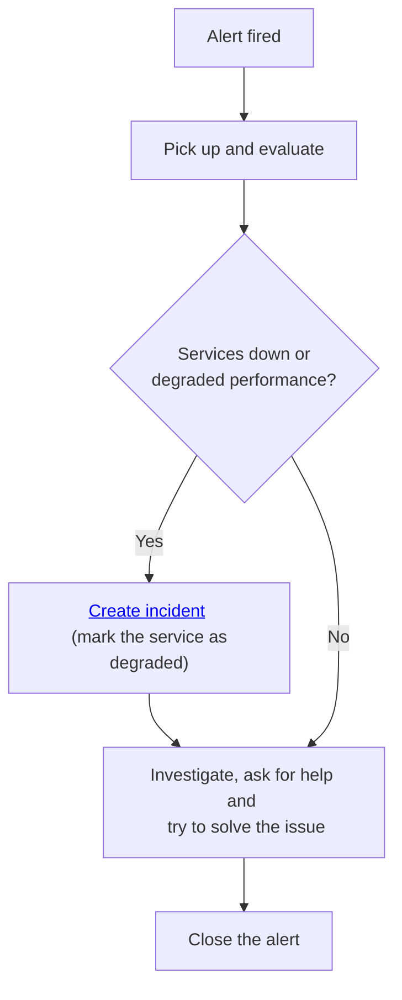

# Overview

In order to better support our users and detect issues at an early point we (Allen) rely on the following services: Context, Grafana, iLert and Sentry.

# Context

[Context](https://allen.ingka.com/catalog/default/component/context/docs){:target="\_blank"} is a Observability Platform offering from Ingka.

Allen is using Context where we're sending logs and metrics and we use the Grafana offering to monitor and search through
logs and manage alerts both from the [kubernetes-mixing](https://github.com/kubernetes-monitoring/kubernetes-mixin){:target="\_blank"} project as well as our custom alerts.

The alerts are then forwarded to iLert and we get notified on our emails and slack channel: `#allen-alerts`

We're using terraform to configure most of things and the code is located at `terraform/application/monitoring`

## Otel collector

Some of the benefits of using an Otel collector are:

- Real-time visibility: Otel Collector captures vital metrics, providing instant insights into the health and performance of your software.
- Proactive issue detection: By continuously monitoring metrics, potential issues can be identified and addressed before they escalate, ensuring smooth operation.

We deploy the Otel collector in the same namespace as our app. Check out the code at `deploy/otel/`

## Grafana

Some of the benefits of using Grafana are:

- Alerting: Grafana allows you to set up customized alerts based on predefined thresholds, ensuring timely notifications when metrics deviate from expected values.
- Visualization: With Grafana's powerful visualization capabilities, you can create intuitive dashboards to monitor key metrics and trends, facilitating informed decision-making.
- Efficient troubleshooting: Grafana's log management capabilities enable quick and effective troubleshooting by allowing you to search through logs, pinpointing the root cause of issues with ease.
- Comprehensive insights: By correlating logs with metrics, you gain a comprehensive understanding of your system's behavior, facilitating proactive problem resolution.

### Dashboards

Some of the dashboards we use in Grafana are:

- [Allen](https://grafana.context.ingka.com/d/ab436d7f-6c6d-4c95-b0e9-11f867ddde72/allen?orgId=4){:target="\_blank"}
- [K8S Compute Resources](https://grafana.context.ingka.com/d/85a562078cdf77779eaa1add43ccec1e/k8s-compute-resources-namespace-pods?orgId=4&refresh=10s){:target="\_blank"}

### Alerts

Out of the box Grafana comes with some built-in notifications that are based on [kubernetes-mixing](https://github.com/kubernetes-monitoring/kubernetes-mixin){:target="\_blank"} and while we leverage those we also have our own custom alerts that are managed through terraform. If you want to add or edit
the custom alerts you can do so by editing the `terraform/application/monitoring/alerts.tf` file.

**TIP**: When adding new alerts it is easier if you use the grafana UI and then export the alert in terraform format. You might need to edit/improve it a bit but it is a good starting point.

# iLert

Some benefits of using iLert:

- Centralized incident management: iLert is a centralized platform for managing incidents, enabling rapid response and resolution to issues that impact service availability.
- On-call schedule management
- Status page visibility: Status pages offer transparency to users, keeping them informed about the current state of our services and minimizing customer impact during downtime.

Most of the configuration in iLert is done through terraform. Check out the code at `terraform/application/monitoring`.

## Status pages

### Production

[https://allen-production.ilert.io](https://allen-production.ilert.io){:target="\_blank"}

### Staging

[https://allen-staging.ilert.io](https://allen-staging.ilert.io){:target="\_blank"}

## Managing incidents

As of now, managing incidents in iLert is a manual step taken by the core team and the process is as follows.

1. Alert gets fired and we get a notification in our emails and the slack channel
2. Someone from the core team takes responsibility and tries to evaluate the alert
3. If the alert indicates that some critical issue occurred create an incident out of
   the template and change the service status to degraded or anything relevant
4. Try to solve the issue
5. Close the alert

# Sentry

Some of the benefits we get by integrating with sentry are:

- Frontend error monitoring: Sentry.io detects and captures errors in the frontend, allowing you to identify and address issues that impact user experience promptly.
- Enhanced user satisfaction: By proactively addressing frontend errors, you ensure a smooth and seamless user experience, enhancing overall user satisfaction and loyalty.

You can check out our project at: [Allen](https://ingka.sentry.io/projects/allen/?project=4506196427210752){:target="\_blank"}
